# CMPE 172 - Lab #10 Notes

## Screenshots and discussion

### CI

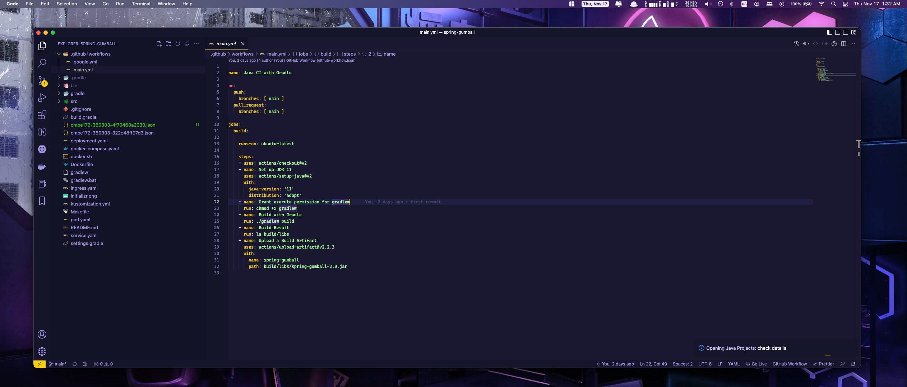

- This image show to yaml file to configure the action for CI part. Which is setting running build on the Github Action environment
  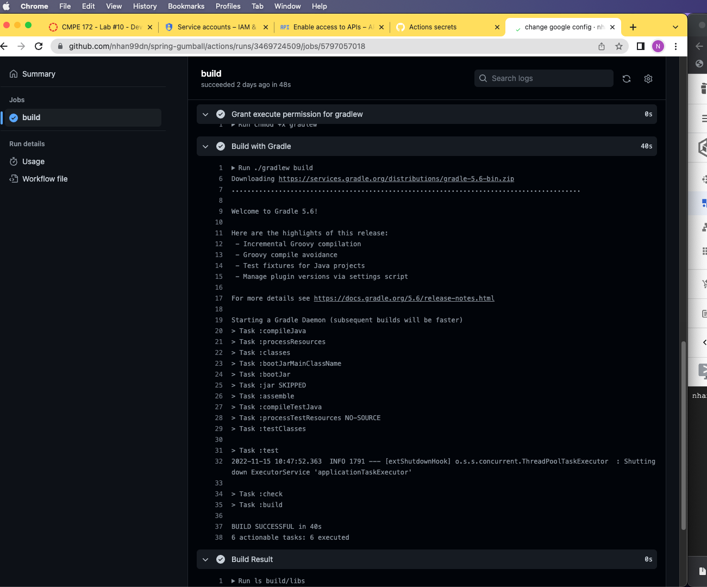
- This image show that after `git push`, new commits get committed, which trigger the CI job
  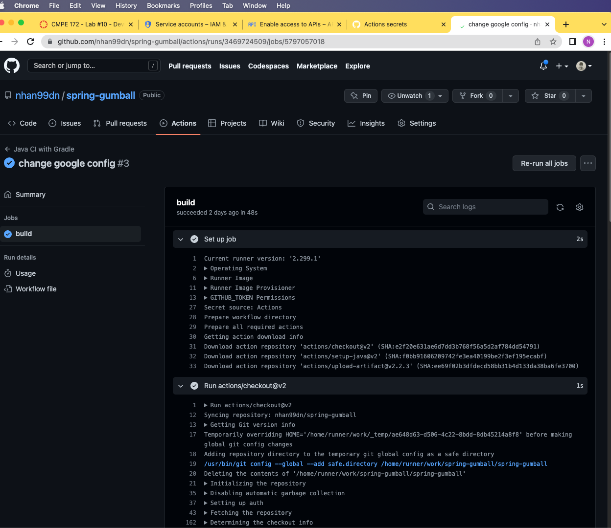
- More image for the logs run of succesful job, which is expected

### CD

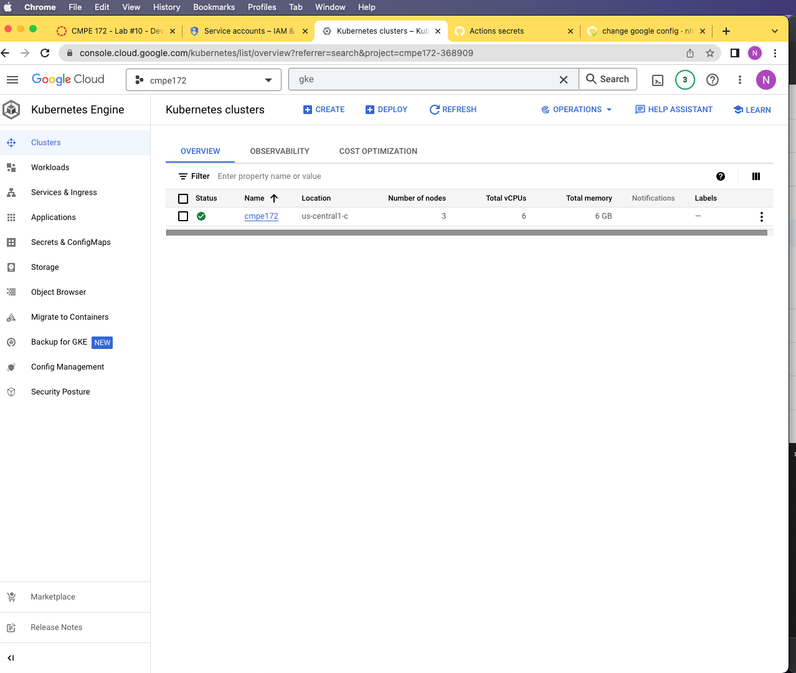

- In this image, new GKE cluster has been created which is a zonal type at us-central1-c location
  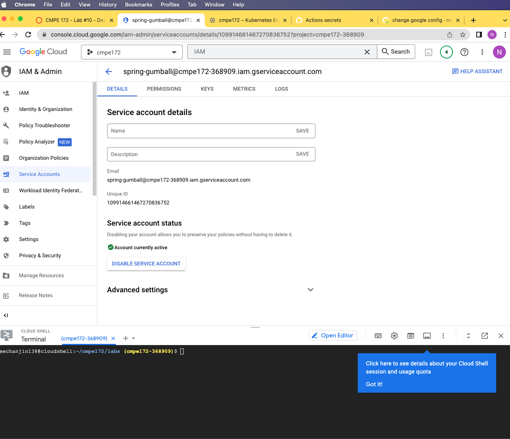
- We have created a new service accounts, which include the necessary permission `k8s developer` and `storage admin`
  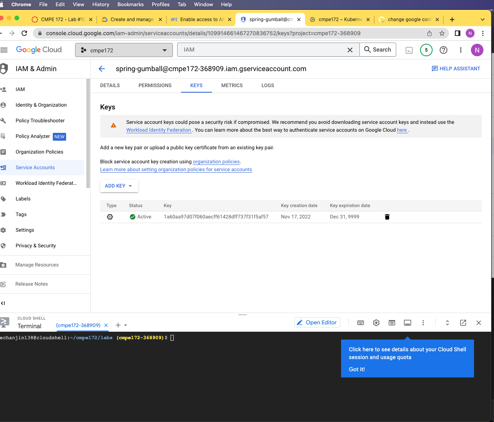
- We have created the JSON key for authentication when Github try to access to GKE resources
  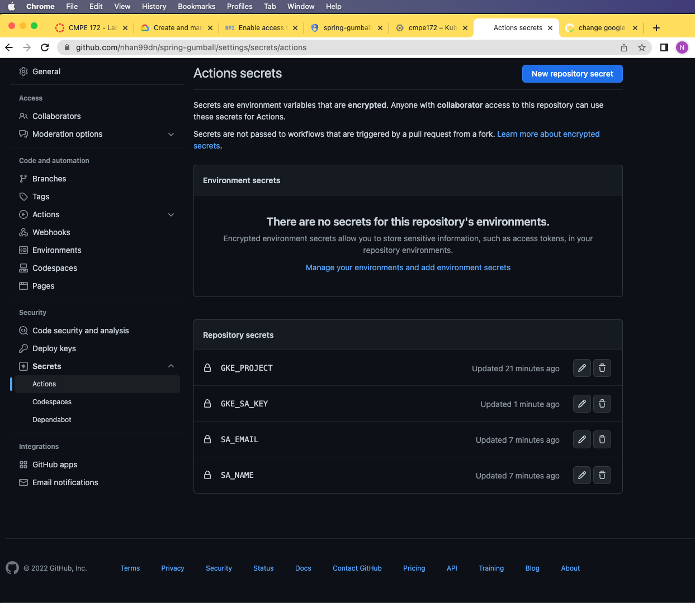
- We have configured secrets on Github project, this is necessary because we want to keep these secrets safe under Github servers, instead of hardcoded these value and commited to Github.
  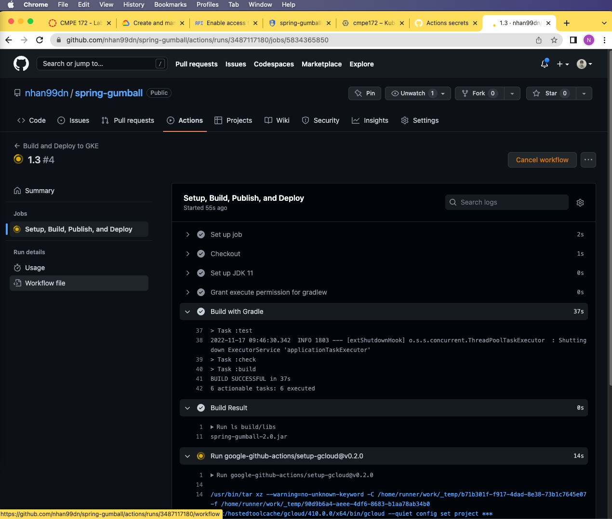
- Here is the job after it being trigger by the release event (meaning that we want to trigger build and push to GKE after a release has been made)
  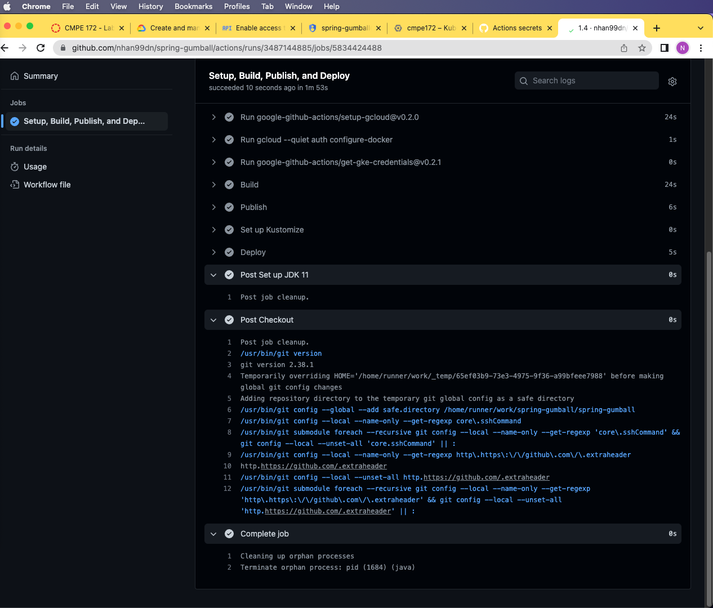
- More logs on the job ....
  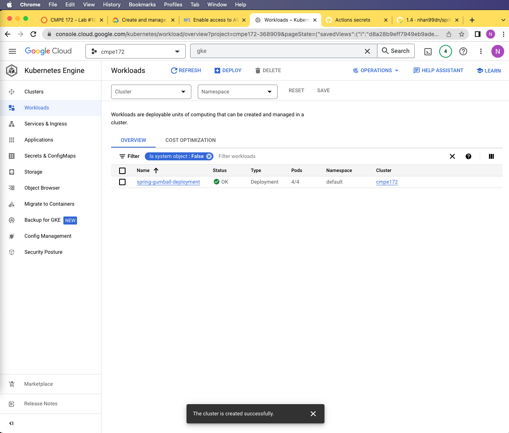
- Confirmation of the deployment has been automatically created
  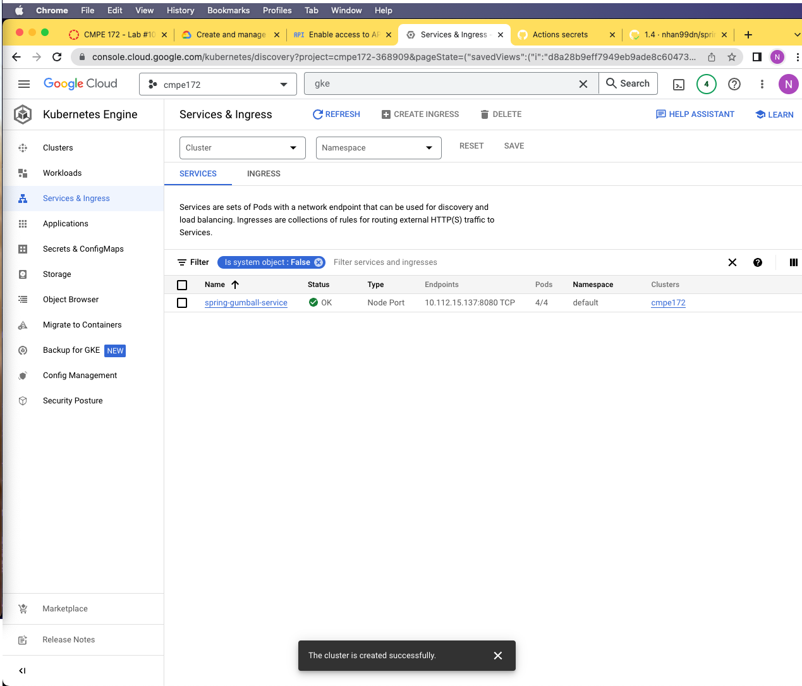
- Confirmation of the service has been successfully created
  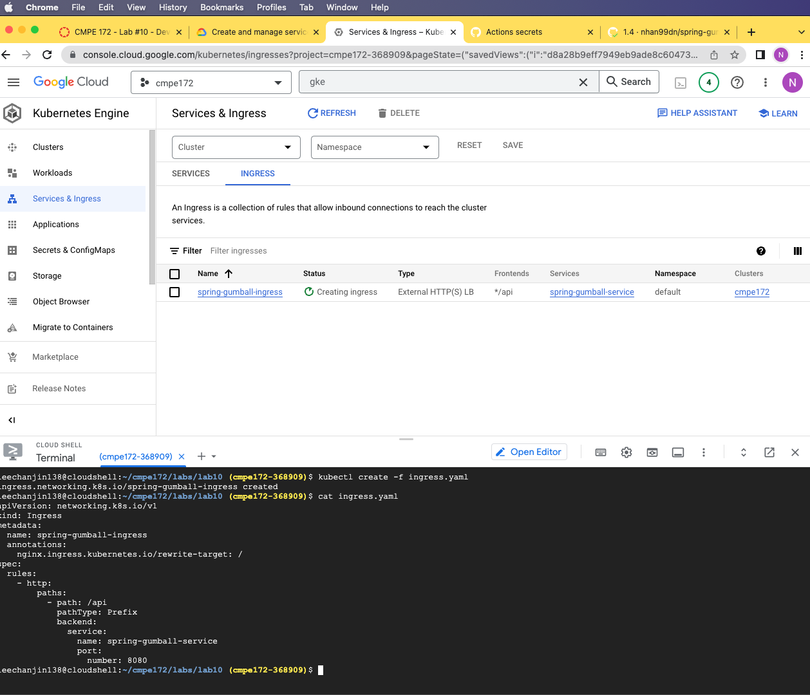
- We want to configure the ingress to expose the service to outside network.

Here is what I have use

```yaml
apiVersion: networking.k8s.io/v1
kind: Ingress
metadata:
  name: spring-gumball-ingress
  annotations:
    nginx.ingress.kubernetes.io/rewrite-target: /
spec:
  rules:
    - http:
        paths:
          - path: /api
            pathType: Prefix
            backend:
              service:
                name: spring-gumball-service
                port:
                  number: 8080
```


- It works! The ingress help expose the service and the image confirm that the setup works nicely.
